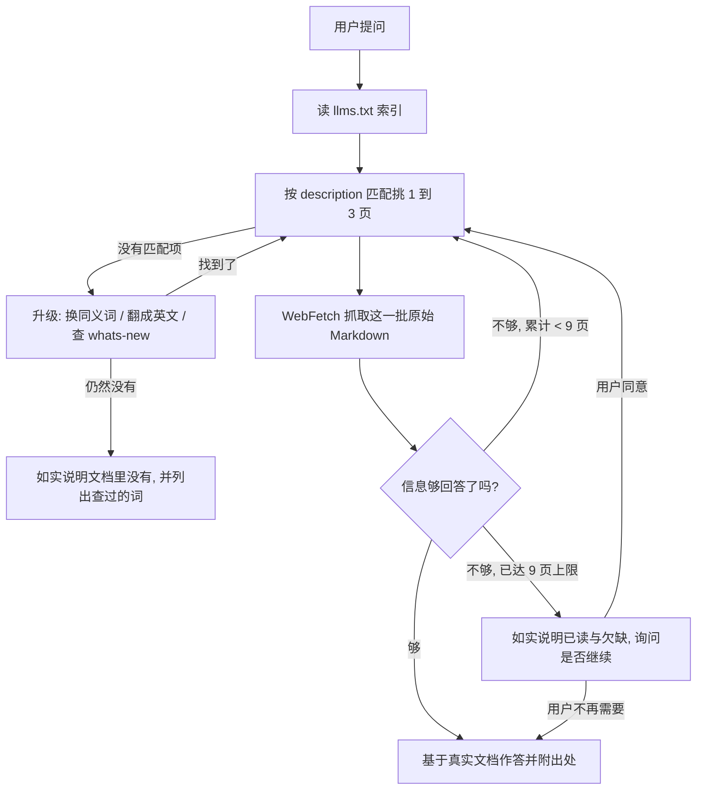

> 这是 [README.md](README.md) 的中文翻译, 只供人阅读。**英文版是权威版本**, 两者不一致时以英文版为准,
> 并把这份翻译改过来。维护是单向的: 改了英文版就回来同步这份, 反过来不成立。

# Claude Code 文档索引 Skill

这个 Skill 让 agent 在需要了解 Claude Code 时，不再依赖训练时记住的、可能已经过期的知识，而是去读官方文档的最新版本。Claude Code 的命令、配置项、hooks、MCP、权限模型几乎每周都在变，靠记忆回答很容易出错，而且错得没有声音。这个 Skill 的作用就是把「先查官方文档、再回答」这件事固化成一个稳定流程。

---

## 1. 它解决什么问题

假设你要写一段关于 Claude Code hooks 的说明，或者你在配置 MCP 时遇到了报错，又或者你想知道某个 settings 字段到底是什么含义。这些问题的答案都在官方文档里，而且官方文档随时会更新。如果直接凭印象回答，你给出的 slug、字段名、命令格式很可能已经被改掉了。

这个 Skill 的定位很单纯：凡是关于 Claude Code 本身的问题，它都先去官方索引里找到对应页面，抓取当前内容，再基于真实文档作答。它覆盖 Claude Code CLI（slash 命令、settings、权限、hooks、MCP、plugins 与 marketplace、subagents、agent teams、workflows、worktrees、channels、routines、定时任务、sandbox、CLAUDE.md 记忆等）、Claude Agent SDK（Python 与 TypeScript）、桌面端 / Web / 移动端 / Slack / Chrome / VS Code / JetBrains 等各个使用面，以及部署、CI、网关和企业管理员场景。

需要区分一个边界：如果问题是关于 Anthropic API 或 Anthropic SDK 本身，而不是 Claude Code 这个工具，那应该走 `claude-api` Skill，而不是这个。

---

## 2. 怎么用

大多数时候你什么都不用做。当你手头的任务依赖 Claude Code 的官方信息时，直接触发这个 Skill，它会自己完成查询。你可以把一个具体话题作为参数传进去（比如 `hooks` 或 `MCP setup`），也可以什么都不传，让它从当前对话里自己推断你要查的主题。

它的输出会落在真实文档内容上，并在陈述不那么显然的事实时附上文档标题和 URL，方便你回去核对。换句话说，你从它这里拿到的不是一段综合了旧知识的复述，而是当前官方文档怎么说，它就怎么传达。

一句话总结前半段：只要你要做的事情依赖 Claude Code 的官方最新信息，参考这个 Skill 就够了。

---

## 3. 底层原理，给维护者看

从这里往下是写给维护这个 Skill 的人看的，讲清楚它到底是怎么被造出来的，为什么这么设计。

整个 Skill 的核心思想是惰性加载（lazy load）。它不把上百页文档塞进 prompt，而是只依赖一个入口，也就是官方维护的索引文件 https://code.claude.com/docs/llms.txt 。这个索引是一个扁平的列表，2026-07-30 实测 174 条、38,847 字节（约 9,700 tokens），每一条都带一段真实的描述（不是「了解一下 X」这种模板话），长这样：

```
- [Title](https://code.claude.com/docs/en/<slug>.md): description
```

注意每个 URL 本身就以 `.md` 结尾，抓下来的是原始 Markdown，不是渲染后的 HTML，这让内容对 agent 更友好，也便宜得多——实测 `hooks.md` 的 Markdown 是 242,078 字节，而同一页的 HTML 是 2,423,751 字节，差了大约十倍。这里有个容易踩的坑：**URL 要原样使用，不要再追加一次 `.md`**，追加之后会 404。

还有两个实测数字值得记住。第一，各页体积差 25 倍：最小的 `troubleshooting.md` 是 10,628 字节，最大的 `settings.md` 是 272,484 字节。所以给 `WebFetch` 的 prompt 必须是一个具体问题，写「总结这一页」在 270 KB 的页面上等于浪费大半次抓取。第二，同目录下还有一个 `llms-full.txt`，6,556,407 字节、约 164 万 tokens，那是全文 dump 不是索引，**任何情况下都不要抓它**。

完整的实测事实表、分层决策（为什么是 T0/C0、放弃了哪些方案）、以及什么情况下这个设计会失效，都记录在 `references/mechanism.md` 里。其中最需要盯住的一条：索引现在是 38,847 字节，而 T0（整份索引仍能轻松放进上下文的那条线）的阈值是 40,000 字节，也就是说已经用掉了 97%。`whats-new/2026-wNN` 周报页每周新增一条，再加上新功能页，越过阈值大概是几周内的事。到那时设计要改成 T2：由脚本去搜索索引，只把命中的行读进上下文。

---

## 4. 工作流程是怎么设计的

Skill 的执行分成几步，而且核心是一个「小批次 + 评估 + 循环」的过程，不是一次性读完就结束。

**第一步是读索引。** 它用 `WebFetch` 把 `llms.txt` 整个抓下来，要求返回未经改动的原始 Markdown，保留每一条 `- [Title](URL): description`。这一步不能跳过，哪怕你觉得自己记得目标 URL。因为文档的 slug 会被重命名，索引才是唯一可信的真相来源。

**第二步是挑页面。** 它拿用户的问题去和每一条的 description（冒号后面那段描述）做匹配，而不是只看标题。匹配时有几条纪律：一个批次只挑一到三页，索引是用来分诊的，不是用来批量灌数据的；一个具体的功能问题对应一页；跨概念的问题（比如「skills 和 subagents 是什么关系」）才分别抓多页。同一个主题可能散在几页里——比如 hooks 就有 `hooks.md` 参考手册、`hooks-guide.md` 教程、`agent-sdk/hooks.md` SDK 版三份——要挑对用户真正问的那一份。如果索引里没有明显匹配的条目，就如实说没有，绝不去猜一个 URL。

**如果索引里看起来没有匹配项，不能直接下结论说文档里没有**，要按顺序升级。这一步是 0.2.0 新加的，因为它对应两个真实的失败模式。一是同义词错配：用户说的词往往不是文档用的词，实测「resume」在 174 条标题里出现 **0 次**，却在描述里出现 5 次，答案实际在 `sessions.md`（*Manage sessions*）下面。二是语言错配：这份索引只有英文，实测中文「钩子」命中 **0 条**，而英文「hook」命中 17 条——所以非英文查询查不到，跟文档有没有覆盖完全是两回事，必须先翻成英文再查一遍。这两轮都空了，再去看 `whats-new/` 的周报页，新功能常常只在那里出现。最后才可以说「文档里没有」，并且要讲清楚查过哪些词。

**第三步是抓取这一批。** 对每个选中的 URL 发一次 `WebFetch`，prompt 写成一个能捕捉用户真实需求的问题，而不是笼统的「总结这一页」。

**第四步是评估，然后决定回答还是继续循环。** 这是承重的一步：抓完一批之后，先判断这些内容够不够回答用户的问题。够了，就基于抓回来的内容作答并附上出处；不够（答案其实在另一页、或某一页指向了别的页面），就回到第二步，再挑下一批一到三页继续抓。这个循环会一直走下去，直到能回答为止，但设了一个默认上限：全过程最多读九页。如果读满九页还是不够，就停下来，如实告诉用户已经读了哪些、还缺什么，并询问要不要继续读更多页——既不偷偷突破上限，也不用猜测去填补空缺。



---

## 5. 几条硬规则背后的道理

这个 Skill 有几条看起来很严的规则，每一条都对应一个真实的失败模式，维护时不要轻易放宽。

**不许编造文档 URL**，是因为一旦允许猜 slug，agent 就会在页面不存在时凭直觉拼出一个看似合理却错误的地址，把用户引到 404 或错误内容。宁可说「索引里没有」。

**不许跳过读索引这一步**，是因为 slug 会改名，缓存在模型里的旧地址迟早失效，只有每次重新读索引才能拿到当前有效的映射。

**必须守住范围**，只覆盖 `code.claude.com/docs/*`，是为了和 `claude-api` 这个 Skill 划清边界，避免两者互相污染答案。

**尽量原样传达文档内容，不要激进地和旧知识融合**，是因为用户要的是当前权威行为，而不是一份掺了过时假设的综述。

**「小批次循环 + 九页上限 + 到顶就问用户」** 这套机制之所以存在，而不是一次抓一大堆或者无限抓下去，是因为要在两种失败模式之间取平衡。一次抓太多会把无关内容灌进上下文、稀释信号；而遇到复杂问题只抓一批又常常不够。小批次让每一步都带着「够不够」的判断前进，循环保证信息不足时会继续补，九页的上限则防止在找不到答案时无声地烧掉大量抓取。到顶之后把选择权交回用户，是因为「继续深挖还是就此打住」本质上是用户的判断，Skill 不应该替他们默默决定，更不该用猜测把答案凑齐。

**先升级再下结论**，是最新加的一条。之所以要把「换同义词、翻成英文、查周报页」写成硬性步骤，是因为「查不到」这个失败是无声的——agent 搜一次没命中，就会自信地回答「官方文档里没有这个功能」，而用户没有任何线索知道它只是搜错了词或用错了语言。上面那两个实测数字（resume 在标题里 0 次、钩子 命中 0 条）就是这条规则存在的全部理由。

理解了这五节，你就能明白这个 Skill 为什么只有一个入口文件、为什么严格限制抓取页数、为什么把「先查再答」写死成流程。它本质上是一台把「官方文档」转化成「可复用 agent 能力」的小机器，而可靠性来自于它始终从同一个可信索引出发。
