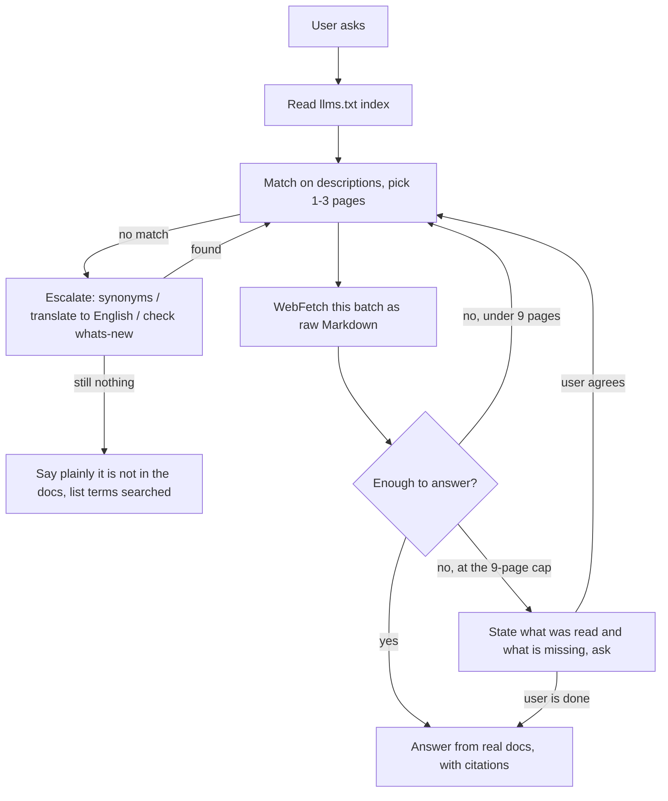

# Claude Code Docs Lookup Skill

This skill makes the agent read the current official Claude Code documentation instead of
relying on what it happened to memorize at training time. Claude Code's commands, config
fields, hooks, MCP surface, and permission model change nearly every week, so answering from
memory goes wrong quietly. What this skill does is turn "look it up first, then answer" into a
fixed procedure.

---

## 1. What problem it solves

Say you are writing an explanation of Claude Code hooks, or you hit an error configuring MCP,
or you want to know what a particular `settings` field actually means. All of those answers
live in the official docs, and the official docs move. Answer from impression and the slug,
field name, or command shape you produce may already have been renamed.

The skill's job is narrow: for any question about Claude Code itself, find the matching page in
the official index, fetch its current content, and answer from that. It covers the Claude Code
CLI (slash commands, settings, permissions, hooks, MCP, plugins and marketplaces, subagents,
agent teams, workflows, worktrees, channels, routines, scheduled tasks, sandboxing, CLAUDE.md
memory), the Claude Agent SDK (Python and TypeScript), every surface — desktop, web, mobile,
Slack, Chrome, VS Code, JetBrains — and the deployment, CI, gateway, and enterprise-admin
material.

One boundary matters: a question about the **Anthropic API or the Anthropic SDK** rather than
about Claude Code the tool belongs to the `claude-api` skill, not this one.

---

## 2. How to use it

Most of the time you do nothing. When your task depends on official Claude Code information,
the skill triggers and runs the lookup itself. You can pass a specific topic as an argument
(`hooks`, `MCP setup`), or pass nothing and let it infer the topic from the conversation.

Its answers land on real doc content, and it cites the doc title and URL when stating anything
non-obvious so you can check. What you get back is not a paraphrase blended with stale
knowledge — it is what the current official docs say.

In one line: if what you are doing depends on current official Claude Code information, this
skill is enough.

---

## 3. The underlying design, for maintainers

From here down is for whoever maintains this skill — what it is actually made of and why.

The core idea is lazy loading. It does not stuff a hundred-odd pages into the prompt; it
depends on a single entry point, the officially maintained index at
https://code.claude.com/docs/llms.txt. That index is a flat list — measured 2026-07-30 at 174
entries and 38,847 bytes (~9,700 tokens), every entry carrying a real description rather than
"Learn about X" boilerplate. Each line looks like:

```
- [Title](https://code.claude.com/docs/en/<slug>.md): description
```

Note that each URL already ends in `.md`, so what comes back is raw Markdown rather than
rendered HTML — friendlier for an agent and far cheaper: `hooks.md` measures 242,078 bytes of
Markdown against 2,423,751 bytes for the same page as HTML, roughly a 10× difference. One trap
here: **use the URL verbatim, do not append another `.md`** — that 404s.

Two more measured numbers are worth keeping in mind. First, page sizes span 25×: the smallest,
`troubleshooting.md`, is 10,628 bytes; the largest, `settings.md`, is 272,484 bytes. So the
prompt handed to `WebFetch` has to be a specific question — "summarize this page" against a
270 KB page wastes most of the fetch. Second, a sibling file `llms-full.txt` sits in the same
directory at 6,556,407 bytes (~1.64M tokens); that is a full-text dump, not an index, and it
must **never** be fetched.

The full measured fact sheet, the tier decision (why T0/C0, which alternatives lost), and the
conditions that would invalidate the design are recorded in `references/mechanism.md`. The one
line to watch: the index is at 38,847 bytes against a T0 threshold — the point where the whole
index still fits comfortably in context — of 40,000 bytes, i.e. 97% consumed. The weekly
`whats-new/2026-wNN` pages add an entry each week, plus new feature pages, so crossing that
line is a matter of weeks. At that point the design moves to T2: a script searches the index
and only matching lines enter context.

---

## 4. How the procedure is designed

Execution splits into several steps, and the heart of it is a small-batch, evaluate, loop
process rather than one exhaustive read.

**Step one, read the index.** It `WebFetch`es the whole of `llms.txt`, asking for unmodified
raw Markdown so every `- [Title](URL): description` line survives. This step is not skippable,
even when you think you remember the target URL, because doc slugs get renamed and the index is
the only trustworthy source of truth.

**Step two, pick pages.** It matches the user's question against each entry's description — the
part after the colon — not just the title. A few disciplines apply: one to three pages per
batch, since the index is for triage and not for bulk loading; one specific feature question
maps to one page; only a cross-concept question ("how do skills relate to subagents?") justifies
several. A single topic may be spread across pages — hooks has `hooks.md` (reference),
`hooks-guide.md` (how-to), and `agent-sdk/hooks.md` (SDK) — so pick the one matching what was
actually asked. And if nothing in the index matches, say so; never guess a URL.

**If nothing in the index looks like a match, you may not conclude the topic is undocumented.**
You escalate, in order. This step was added in 0.2.0 because it covers two real failure modes.
The first is vocabulary mismatch: the user's word is often not the docs' word. Measured, "resume"
appears in **zero** of the 174 titles but in five descriptions — the answer is under
`sessions.md` (*Manage sessions*). The second is language mismatch: this index is English-only,
and the Chinese query `钩子` matches **zero** entries where the English `hook` matches 17. So a
non-English miss says nothing whatever about coverage, and the query has to be translated and
retried. If both rounds come up empty, check the weekly `whats-new/` pages, where new features
often appear first. Only then may you say it is not in the docs — and you say which terms you
searched.

**Step three, fetch the batch.** One `WebFetch` per selected URL, with a prompt phrased as a
question that captures the user's real need rather than a generic "summarize this page".

**Step four, evaluate, then answer or loop.** This is the load-bearing step. After each batch,
judge whether the content answers the question. Enough — answer from what was fetched, with
citations. Not enough (the answer lives on another page, or a fetched page pointed elsewhere) —
go back to step two and pick the next one to three pages. The loop continues until it can
answer, with a default ceiling of nine pages total. At nine and still short, it stops, states
honestly what it has read and what is missing, and asks whether to continue — neither quietly
blowing past the cap nor filling the gap with guesses.



---

## 5. The reasoning behind the hard rules

Several rules look strict. Each maps to a real failure mode, so do not loosen them casually.

**No inventing doc URLs**, because the moment slug-guessing is allowed, the agent will confect a
plausible-looking wrong address whenever a page does not exist and send the user to a 404 or to
the wrong content. Better to say "not in the index".

**No skipping the index read**, because slugs get renamed and any address cached in the model
eventually goes bad. Only re-reading the index gives the currently valid mapping.

**Stay in scope**, covering `code.claude.com/docs/*` only, to keep a clean boundary with the
`claude-api` skill so the two do not contaminate each other's answers.

**Pass the docs through rather than aggressively blending them with prior knowledge**, because
the user wants current authoritative behavior, not a synthesis laced with outdated assumptions.

**Small batches, a nine-page cap, and asking the user at the ceiling** exist to balance two
failure modes. Grabbing too much at once floods the context with irrelevance and dilutes the
signal; grabbing a single batch often is not enough for a hard question. Small batches make
every step carry an "is this enough?" judgment, the loop guarantees more gets fetched when it
isn't, and the cap prevents silently burning a large number of fetches on a question that
cannot be answered. Handing the choice back at the ceiling is deliberate: whether to keep
digging is fundamentally the user's call, and the skill should neither decide it silently nor
paper over the gap with guesses.

**Escalate before concluding absence** is the newest rule. The failure it prevents is silent:
the agent searches once, misses, and confidently reports "that feature isn't in the official
docs" — with nothing to tell the user it merely searched the wrong word in the wrong language.
The two measured numbers above ("resume" in zero titles, `钩子` matching zero entries) are the
entire justification for the rule.

Understanding these five sections is enough to see why the skill has one entry point, why it
caps fetches so strictly, and why "look it up, then answer" is hardcoded as a procedure. It is
a small machine for converting official documentation into reusable agent capability, and its
reliability comes from always starting at the same trustworthy index.
