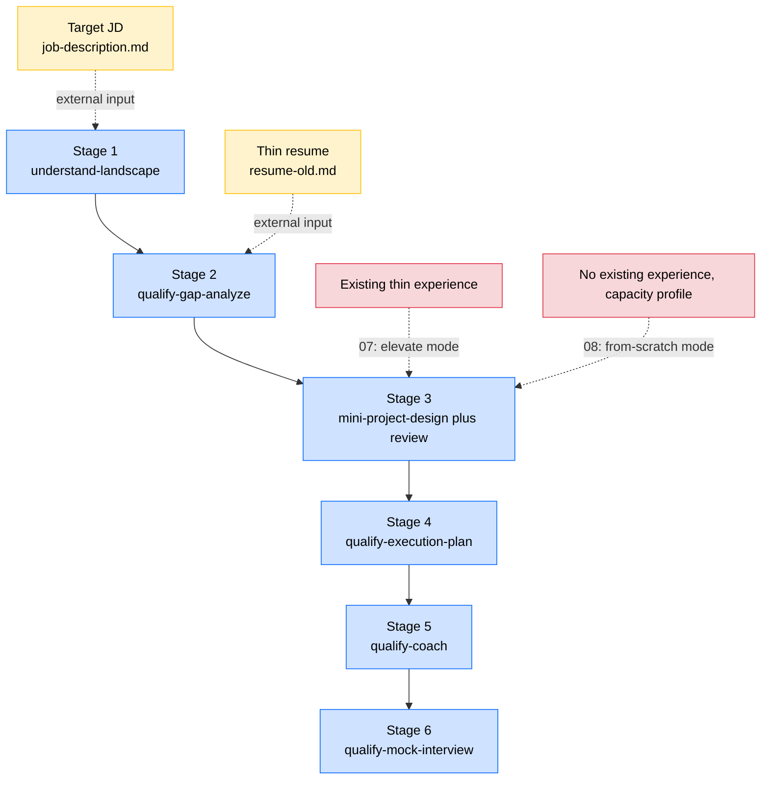

# Designing a Project from Nothing: Start at the JD, End Interview Ready

> Eighth in the examples series. This is the third route to project material, the one you take when your resume has nothing relevant on it and all you have is a job you want.

## 1. Overview

Lesson 06 named three ways to get project material. Lesson 07 took the second one, where a thin piece of experience already exists and you rebuild it into something deeper. This lesson takes the third, which is the position nobody wants to be in. **Your resume has nothing relevant on it.** What you do have is a specific posting, and that turns out to be enough to work with. Anchor on it, then reason backward until you land on a project worth building.

Most of this lesson is already yours if you finished 07. The six stages do not change. One call changes. Stage 3, `mini-project-design`, ran in `elevate` mode before, shuffling facts around inside experience you actually lived. Here it runs in `from-scratch` mode and designs something that does not exist yet.

So there is really only one new idea to absorb: the chain does not care whether you brought anything with you. Everything upstream and downstream of stage 3 behaves exactly as it did.

---

## 2. Learning Objectives

Almost nobody is stuck at "my experience is a little thin." They are stuck at zero. Two class projects, one internship in an unrelated field, and a posting that wants Go, gRPC, and Kubernetes.

There are two popular ways to handle that, and neither one works. You can bury the gap under more LeetCode, which feels productive and changes nothing about the part of your resume that is actually failing. Or you can make something up, which holds until roughly the second follow-up question.

The third option is slower and it is the only one that survives contact with an interviewer. Commit to a single posting, reason backward to a project that closes the gaps it exposes, push the design until it withstands questioning, and then **go build the thing**. This lesson teaches that sequence, plus the rule attached to it: if you have nowhere to actually execute the design, the design is a wish.

By the end of this mini task, you will be able to:

1. Identify stage 3 as the single divergence between the 07 and 08 chains, and describe what `elevate` mode and `from-scratch` mode each consume and produce.
2. Contrast the forward-looking case with the executed case in both tone and substance, and place the case file at each point on the timeline.
3. Explain what a venue is, why a design doc without one is worthless, and what question 08 adds to review that 07 never needs.
4. Sketch the triangle formed by the mentor-designed, elevate, and from-scratch routes, and account for why all three feed the same downstream pipeline.
5. Run from-scratch against a real target: your gap list, your forward-looking case, your venue.

---

## 3. Prerequisites

- You have read [06-prepare-project-material](../06-prepare-project-material/README.md) and can name the three routes.
- You have worked through [07-elevate-existing-project](../07-elevate-existing-project/README.md). This lesson reuses that workflow and swaps one mode, so if 07 landed, most of what follows is already yours.
- You can run the `understand-landscape` skill from the career_planning prerequisite course, turning one posting into four research pieces (industry, company, role, market) plus an index.
- You have a posting for a job you genuinely want. The exercises need it.

---

## 4. What You Will Build or Learn

No code in this lesson. What comes out is a design document and a standard for deciding whether it is any good.

You walk away with two things. First, a forward-looking case draft aimed at your own posting, written start to finish in the future tense: this is what I am going to build. Second, one question that can veto the entire design, which is whether you have any real path to doing the work. The draft is the material. The question is what keeps the material from turning into fiction.

---

## 5. The Workflow at Its Core: Same Chain as 07, Different Starting Point

The six-stage chain from [07, section 2, the workflow at its core](../07-elevate-existing-project/README.md) runs landscape → gap analysis → project case → fill plan → coach → mock. Lesson 08 reuses it exactly and changes one thing: stage 3 gets called in `from-scratch` mode instead of `elevate`.

Before the diagram, look at the artifacts. This section assumes you **already read** [07, section 2](../07-elevate-existing-project/README.md), where all nine artifact types are laid out. The 08 list is almost the same, with three exceptions:

| Difference | 07 (elevate) | 08 (from-scratch) |
| :--- | :--- | :--- |
| The original thin experience file | Present, and the core input to stage 3 | Gone. You start on a blank page, so stage 3 takes one fewer input |
| Voice of [`case.md`](../../students/john-doe/experiences/from-2026-04-to-2026-09-pulse-social-feed-ranker/qualify-for-Pulse-Social-Backend-Engineer-Intern/case.md) | Retrospective. I did, I built | Forward-looking. I plan to, I will, since it gets written before anything happens |
| [`executed-case.md`](../../students/john-doe/experiences/from-2026-04-to-2026-09-pulse-social-feed-ranker/executed-case.md) | No equivalent | An extra file. The grown-up case, written after twelve weeks of real work, recording what actually happened. See section 9 |

The diagram draws the workflow as a trunk with side channels feeding into it. Stages 1 through 6 run top to bottom in blue; dashed arrows are the external inputs each stage needs. **Stage 3 is the only node whose shape differs between 07 and 08**, so it shows two candidate inputs: existing experience for 07 (`elevate` mode), and no existing experience plus a capacity profile for 08 (`from-scratch` mode).

The chain itself does not move. Each stage inherits everything produced so far, takes one new input, and hands back something new. By stage 6 the stack is exactly as tall as it is in 07: resume, JD, five landscape pieces, gap analysis, case, learning plan, POC work, mock interview transcripts.

Only stage 3 behaves differently. In 07 it inherits a locked business context. Same company, same dates, same mentor, and all the skill can do is rearrange facts inside that box. In 08 there is no box. The skill switches to `from-scratch` and hands back something forward-looking, describing **what you are going to do** rather than what you did.

Same skeleton, different parameters. That is the whole relationship between 06, 07, and 08.

---

## 6. John's Starting Point: One Posting and a Blank Page

Rejoin John at a different point on his timeline. Late January into early February 2026, the last hiring window before the Summer 2026 internship search closes for good.

His resume is still [resume-old.md](../../students/john-doe/resume-old.md). One thin SQL reporting internship at Cedar Ridge, just finished, plus a handful of course projects. The summary calls him "interested in data systems and applied ML," a sentence that also describes roughly 99 percent of his CS master's cohort.

He wants to change lanes. Cedar Ridge was data and BI work; he would rather do backend engineering. On January 15, 2026, Pulse Social posted a Backend Engineer Intern role, and that posting lives at [job-description.md](../../students/john-doe/experiences/from-2026-04-to-2026-09-pulse-social-feed-ranker/qualify-for-Pulse-Social-Backend-Engineer-Intern/job-description.md). It is unusually direct about what it wants: Go, SQL, microservices, gRPC, Kubernetes, Redis, message queues.

John counts what he has. Zero lines of Go. Distributed systems as a course, not as something he has ever operated. gRPC, never. Kubernetes amounts to one afternoon with minikube on his laptop. Add it up and **he has done essentially none of what this posting asks for**.

The 07 playbook is no help. There is no Pulse-shaped backend internship in his past to reinterpret. So he flips the question around: **if I do land this internship in June, what should I build over those twelve weeks so that, looking back from September, the experience lines up with this posting?** That is the door into 08.

---

## 7. Six Stages, Same Skeleton as 07

The table below is nearly identical to the one in [07, section 4](../07-elevate-existing-project/README.md). Row three carries the difference: the skill runs in `from-scratch` mode, existing experience drops out of the input, and the output is forward-looking. Every path points at the real Pulse example.

| Stage | What it does | Input documents | Output documents |
| :--- | :--- | :--- | :--- |
| Stage 1 `understand-landscape` | Treat the posting as a due diligence target and research the industry, company, role, and market | [`job-description.md`](../../students/john-doe/experiences/from-2026-04-to-2026-09-pulse-social-feed-ranker/qualify-for-Pulse-Social-Backend-Engineer-Intern/job-description.md) | Five pieces under [`landscape/`](../../students/john-doe/experiences/from-2026-04-to-2026-09-pulse-social-feed-ranker/qualify-for-Pulse-Social-Backend-Engineer-Intern/landscape/) (only `00-title.md` is filled in for this repo) |
| Stage 2 `qualify-gap-analyze` | Audit the resume honestly against the posting and the landscape | Everything above plus [`resume-old.md`](../../students/john-doe/resume-old.md) | [`gap-analysis.md`](../../students/john-doe/experiences/from-2026-04-to-2026-09-pulse-social-feed-ranker/qualify-for-Pulse-Social-Backend-Engineer-Intern/gap-analysis.md) (stub) |
| Stage 3 `mini-project-design` plus `mini-project-review` (**from-scratch mode**) | Use the gap analysis as the brief and design the case forward, with no existing experience constraining it, across three rounds | Everything above plus the gap analysis plus a capacity profile (**no existing experience**) | [`case.md`](../../students/john-doe/experiences/from-2026-04-to-2026-09-pulse-social-feed-ranker/qualify-for-Pulse-Social-Backend-Engineer-Intern/case.md), forward-looking version |
| Stage 4 `qualify-execution-plan` | Convert the gap analysis and the forward-looking case into a weekly plan, POCs, and tutorials | Everything above plus [`case.md`](../../students/john-doe/experiences/from-2026-04-to-2026-09-pulse-social-feed-ranker/qualify-for-Pulse-Social-Backend-Engineer-Intern/case.md) | [`execution-plan.md`](../../students/john-doe/experiences/from-2026-04-to-2026-09-pulse-social-feed-ranker/qualify-for-Pulse-Social-Backend-Engineer-Intern/execution-plan.md) plus [`pocs/`](../../students/john-doe/experiences/from-2026-04-to-2026-09-pulse-social-feed-ranker/qualify-for-Pulse-Social-Backend-Engineer-Intern/pocs/) plus [`tutorials/`](../../students/john-doe/experiences/from-2026-04-to-2026-09-pulse-social-feed-ranker/qualify-for-Pulse-Social-Backend-Engineer-Intern/tutorials/) |
| Stage 5 `qualify-coach` | Learn the concepts and write the POCs one gap at a time, and find out how hard the case really is | Everything above | `coach-notes/`, generated on the fly inside the [qualify-for directory](../../students/john-doe/experiences/from-2026-04-to-2026-09-pulse-social-feed-ranker/qualify-for-Pulse-Social-Backend-Engineer-Intern/) |
| Stage 6 `qualify-mock-interview` | Let AI play a stranger across the table and put real pressure on the story | Everything above | `mock-interview-{n}.md`, generated on the fly inside the [qualify-for directory](../../students/john-doe/experiences/from-2026-04-to-2026-09-pulse-social-feed-ranker/qualify-for-Pulse-Social-Backend-Engineer-Intern/) |

Everything lands in [`from-2026-04-to-2026-09-pulse-social-feed-ranker/qualify-for-Pulse-Social-Backend-Engineer-Intern/`](../../students/john-doe/experiences/from-2026-04-to-2026-09-pulse-social-feed-ranker/qualify-for-Pulse-Social-Backend-Engineer-Intern/). The folder name records which experience is being qualified and for which role. Look at the dates. The experience folder is named for when the project runs, April through September 2026, even though John starts designing it in February. The name reserves the slot before the work exists.

> Note: stage 1 uses `understand-landscape`, which **the career_planning prerequisite course covers**, so this repo does not teach it. We assume you can already turn one posting into four research pieces (industry, company, role, market) plus an index. If that is unfamiliar, go take that course first. This lesson starts at stage 2. If you are targeting a whole job family instead of one company, [07, section 4.1](../07-elevate-existing-project/README.md) explains how stage 1 folds several postings into a single landscape. 08 handles it the same way.

---

## 8. What the 08 Artifacts Actually Look Like

Section 5 named the artifacts and section 7 linked them, but filenames will not show you how 08 differs in practice. Here are the files whose shape genuinely changes under from-scratch mode.

**[The landscape index, `00-title.md`](../../students/john-doe/experiences/from-2026-04-to-2026-09-pulse-social-feed-ranker/qualify-for-Pulse-Social-Backend-Engineer-Intern/landscape/00-title.md)** (the only piece filled in here): the effort is identical to 07. Pulse is a 200 person consumer social company with 8 million monthly actives, and the Home Feed is where the entire fight happens. Company size, engineering culture, and competitive position all come out of the landscape stage. Once you have that context, the line in the posting about treating the feed as a craft stops reading like filler. They really are betting the company on feed engineering.

**The stage 2 gap analysis** (a stub in this repo): John holds his resume up next to the Pulse posting and nine gaps fall out, sorted into 🔴, 🟡, and 🟠. At least five sit in 🔴 Core: Go engineering, gRPC, hands-on Redis, microservice design, real Kubernetes deployment. Same shape as 07. An honest audit with nothing rounded up.

**[The forward-looking `case.md`](../../students/john-doe/experiences/from-2026-04-to-2026-09-pulse-social-feed-ranker/qualify-for-Pulse-Social-Backend-Engineer-Intern/case.md) next to [the executed `executed-case.md`](../../students/john-doe/experiences/from-2026-04-to-2026-09-pulse-social-feed-ranker/executed-case.md)**: open these two together. The first is future tense. Assuming I land this internship, here is how I plan to build the feed-ranking service. It is John running the project in his head before touching a keyboard. The second is past tense, written months later after the internship ended. Side by side, the arc of this route is obvious: design doc → execution → grown-up case. Nothing in 07 corresponds to this pair.

**The stage 4 artifacts** (the fill plan and POCs are also stubs here): same shape as 07. Every 🔴 and 🟡 gap gets its own mini POC. Go engineering becomes a small Wikipedia QA service written in Go. gRPC becomes a three-RPC contract defined in protobuf, with a client and a server you wire up yourself. Redis becomes a recently-seen filter built on a sorted set. Each POC exists **to learn one skill**, not to imitate a business project. 07 made that point and it holds unchanged.

**The stage 5 and 6 artifacts**: same as 07. Two or three rounds of learn, get tested, learn, get tested, until every 🔴 Core gap is something you can speak to the moment it comes up. Not expanded in this repo either, since they get generated on the fly inside the qualify-for directory.

---

## 9. From Design to Retrospective: What Happens in Between

Nothing in 07 corresponds to this section. John is never going back to redo the Cedar Ridge internship. What he does there is **read it more carefully than he lived it**, and both the resume and the interview rest on that second reading. Here the situation is different. **John is going to build this thing for real.**

Roughly, the timeline runs:

| When | What happened | State of the case file |
| :--- | :--- | :--- |
| Mid to late January 2026 | The Pulse posting goes up and John locks onto it | Does not exist yet |
| February 2026 | Stages 1 through 4: landscape, gaps, case design, learning plan | The **forward-looking** `case.md` appears, describing what he plans to build |
| March into April 2026 | Stages 5 and 6: POC work plus two or three mock interviews | The case sits untouched while learning artifacts accumulate in `pocs/` |
| April 2026 | Pulse interviews, offer in hand | The forward-looking case gets told and retold across the loop |
| June through September 2026 | Twelve weeks at Pulse, actually building it | The case is the design doc he and his mentor align on in week one |
| After September 2026 | Project done, retrospective | The case grows into [`executed-case.md`](../../students/john-doe/experiences/from-2026-04-to-2026-09-pulse-social-feed-ranker/executed-case.md), recording what really happened |

Anyone taking the 08 route needs to sit with this part. **A design doc that never gets executed is a wish**, and saying so is the one duty 08 has that 07 does not.

Everything hinges on the venue, meaning the place the work actually gets done. A project designed in 08 needs a credible channel to reality: landing the matching internship, contributing to an open source project over a stretch of months, an apprenticeship. John's venue is the Pulse internship itself. If you cannot name one, do not write the doc. A project you have no realistic shot at touching in the next six months is worth nothing on a resume, however elegant the design. It takes one question from an interviewer, did you build this or just think about it, and the story is finished.

Venues are genuinely scarce, so stage 3 in 08 carries a review question 07 never has to ask: **do you have a real way to go do this?** A no means one of two changes. Move to a smaller venue, usually an open source slice you can actually get into. Or cut the scope until it is something you could finish in six months with nobody mentoring you. That feasibility constraint belongs to 08 alone.

---

## 10. Three Routes, One Triangle: What 06, 07, and 08 Are Really Solving

Finishing 06, 07, and 08 also finishes the first half of the course, lessons 01 through 08. Worth stopping to look back before you start writing bullets.

The three routes begin in three different places:

- **Route one, mentor designed**: someone hands you the project and your job is to execute well. John's winter contractor stint at NovaRisk is this one.
- **Route two, elevate, taught in 07**: a thin piece of experience already exists and your job is to **understand it more deeply than you did while living it**. Cedar Ridge into Cascadia runs this way.
- **Route three, from-scratch, taught in 08**: you have a posting and nothing else, and your job is to **reason backward from it to a project worth building**, then go build it. The Pulse line runs this way.

Downstream they collapse into one. Same six stages, same `qualify-gap-analyze`, `qualify-execution-plan`, `qualify-coach`, and `qualify-mock-interview`, same interview room waiting at the end. `mini-project-design` is where elevate and from-scratch live as two modes of a single skill, which is how the routes end up unified in practice.

Strip all three down and they answer the same question:

> All I have is a resume that is not good enough yet and a role I want. How do I plan a project that both thickens the resume and genuinely makes me better, and carry that all the way through applying, interviewing, and defending every decision I made?

Unpacked, that is seven steps. Each names the skill or prerequisite course behind it so you can find your way back.

1. Fix the starting point: a resume that is not good enough yet, plus a role you have already settled on. Career positioning work, taught in the career_planning prerequisite course.
2. Research deeply. Learn the industry, the company, the role family, and the market behind that role. Uses `understand-landscape` from the prerequisite course.
3. Diagnose the gaps. Given the research, name exactly where you fall short. Uses `qualify-gap-analyze`, which produces one honest diagnostic and nothing else. No POCs, no weekly plan.
4. Design the project. Take the gap analysis as your brief and design something neither too hard nor too easy that closes those gaps. Uses `mini-project-design`, with `mini-project-review` iterating alongside it.
5. Work out the execution. Break the project into how you will actually do it, what you need to learn, and which mini POCs to build. Uses `qualify-execution-plan`, taking gap analysis and case as input and returning a weekly plan, POCs, and tutorial placeholders.
6. Test whether you can carry it. Work through some of the material and the POCs and see whether three to six months is realistic. If not, go back to step 4 and design an easier case. If so, lock the case document.
7. Write the resume and apply. By now you know enough to write something that holds up. Bullets the way [09-write-bullets](../09-write-bullets/README.md) teaches, the summary the way [10-write-summary](../10-write-summary/README.md) teaches, submission the way [11-submit-and-collaborate](../11-submit-and-collaborate/README.md) teaches.

What about the stretch between applying and interviewing, where AI walks you through the learning material and then plays interviewer to stress test you? That is `qualify-coach` and `qualify-mock-interview`. It lives between hitting submit and walking into the room, and it is not on the critical path to a resume you can send. Both steps matter. They are just decoupled from getting the resume good enough.

### What Role These Skills Actually Play

You may have noticed the seven steps add up to six skills: `qualify-gap-analyze`, `mini-project-design`, `mini-project-review`, `qualify-execution-plan`, `qualify-coach`, and `qualify-mock-interview`. Those six are the trunk of the workflow across 06, 07, and 08.

The full resume toolkit has ten. The other four (`bullet-writer`, `bullet-reviewer`, `summary-writer`, `summary-reviewer`) arrive in 09 and 10, where the job is compressing a case into bullets and reasoning backward from bullets to a summary. So what you have seen so far is the trunk, not the whole tree.

More importantly, the skills are not the point. They are an engineering wrapper around three things: what goes into a stage, what comes out, and a few quality floors.

Do not get attached to how any of them are written today. Each one is prompt engineering that pins down inputs, outputs, and the usual traps for a single stage, so the behavior stays consistent across very different students. Once the logic of the seven steps belongs to you, you can:

- Run one skill by itself, say `qualify-gap-analyze` for a diagnostic, without the rest of the pipeline.
- Hand a skill extra requirements, background, or constraints. Tell it you have four weeks instead of twelve and need the learning plan compressed, or that you are a PM rather than an engineer and want product case breakdowns instead of POCs.
- Skip a skill entirely and write its inputs and outputs by hand. Run the landscape as a reading group, or take the case straight from a mentor.
- Run the chain backward, starting from a project case and deriving the gap analysis from it.
- Merge several skills' outputs into one document and reorganize it however you like.

> This toolkit does not promise the process is optimal. It promises a floor under the quality of every stage as long as you follow it. Treat the skills as that floor rather than as scripture and you are using them correctly. The seven steps and the inputs and outputs of each are what matter, never the particular way a skill gets invoked. The process is the bones, the skills are the flesh, and the bones are what this course is really handing you.

---

## 11. Exercises

### Exercise 1: Read the Two Cases Side by Side

**Goal:** See for yourself how a design doc and a grown-up case differ instead of taking it on faith.

**How to do it:**

1. Open the forward-looking [`case.md`](../../students/john-doe/experiences/from-2026-04-to-2026-09-pulse-social-feed-ranker/qualify-for-Pulse-Social-Backend-Engineer-Intern/case.md).
2. Open [`executed-case.md`](../../students/john-doe/experiences/from-2026-04-to-2026-09-pulse-social-feed-ranker/executed-case.md) in a second window.
3. Start with tone. Find three places where the language shifts, where a sentence about what he plans to do becomes a sentence about what he did.
4. Move to substance. Find three more, watching for numbers, tradeoffs, and things that went wrong. What made it into the second document only because it actually happened?
5. Close both files and put the design doc → execution → grown-up case arc into your own words.

**What you will see:**

The forward-looking version reads like a proposal. Every decision shows up with a reason for choosing it. The executed version reads like a retrospective, and everything extra in it came out of doing the work. The skeleton is the same in both, because the second grew from the first instead of starting over.

> **Key insight:** The forward-looking case is not a rough draft of the executed one. It is the document you and your mentor align on in week one. Write it loosely and everything downstream comes out loose.

### Exercise 2: Run From Scratch on Your Own Target Posting

**Goal:** Point this chain at your own job search and come away with a forward-looking case draft and a venue you can name.

**How to do it:**

1. Pick a job you actually want and copy the entire posting into your own directory. Not a link. Postings come down, and you will want the text months from now.
2. Take honest stock and write 5 to 9 gaps between where you are and what the posting expects, flagging the Core ones. Nothing rounded up in your favor.
3. Design a forward-looking case for that posting in from-scratch mode. Keep the whole draft in the future tense, describing what you are going to build.
4. Save the feasibility question for last. Do you have a real way to go do this? Write the venue down. A matching internship counts. So does months of genuine contribution to an open source project. So does an apprenticeship.
5. If you cannot answer it, find a smaller venue or cut the scope to something you could finish in six months with nobody mentoring you, then go back to step 3 and rewrite.

**What you will see:**

The gap list in step 2 will sting a little, which means you wrote it correctly. Step 4 is where people actually stall. Plenty of beautifully designed projects die on that question, and dying there is a lot cheaper than dying in an interview six months later.

> **Key insight:** What 08 produces is not the case draft alone. It is the case draft and the venue together. Without the second, the first is an essay.

---

## 12. Recap: What We Learned

- Of the three routes from 06, this is the third: no relevant experience, one posting you want, so you anchor on it and reason backward to a project.
- 07 and 08 share the entire six-stage chain and part ways only at stage 3. `elevate` recombines inside existing experience; `from-scratch` designs forward on a blank page.
- The 08 case is forward-looking and written in the future tense. Once the project is genuinely finished it grows a second version, the executed case. That pair belongs to 08 alone.
- A design doc with no venue is a wish, which is why 08 adds one question at review: do you have a real way to go do this?
- The three routes (mentor designed, elevate, from scratch) begin in different places, share the entire downstream, and finish in the same interview room.
- The leverage here is that the workflow is **forgiving about where you start and strict about where you finish**. You may begin with nothing. You have to end able to defend every decision.

---

## 13. Mentor's Note

**Why this matters:**

"I don't have an internship and I don't have any projects. What do I do?" I get that one more than any other question, and about half the time the student has already answered it before I can say anything. They are going back to LeetCode. I understand why. Grinding problems feels like progress, it takes no decisions, and there is a leaderboard. It also does nothing about the part of the resume that is actually failing.

Here is what does work. Pick one posting you would say yes to tomorrow. Run the 08 chain on it, all the way through, until the design holds up under questions. Then go find somewhere to build it.

And if that job never comes through, none of the effort is wasted. The landscape research, the gap analysis, the case, the POCs you wrote with your own hands are all real work. Point them at the next posting and most of it carries straight over.

That is why 08 gets its own lesson. It starts you from the worst possible position and still walks you to the same finish line as everybody else.

**Key insights:**

- Having no experience is not the obstacle. Having no venue is. The first is an input to this chain; the second is a precondition for it.
- A forward-looking case earns its keep by making you run the project in your head before you commit months to it.
- The artifacts outlive the job. Postings disappear. Your landscape and gap analysis do not.
- The three routes differ at exactly one stage. Do not treat them as three separate methodologies to memorize.

**Next step:**

You now have a full library of project material: an elevated case or a from-scratch one, plus the landscape, gap analysis, fill plan, POC work, and mock interview transcripts around it. The next lesson, [09-write-bullets](../09-write-bullets/README.md), teaches you **how to compress that novel-length case into the three or four bullets that go on a resume**, and how to make sure those bullets survive an interviewer pulling on them.

---

## 14. Quick Reference

**The six-stage chain:** `understand-landscape` → `qualify-gap-analyze` → `mini-project-design` with `mini-project-review` → `qualify-execution-plan` → `qualify-coach` → `qualify-mock-interview`.

**The only difference between 07 and 08:** stage 3. 07 runs `elevate` mode, taking existing thin experience in and returning a retrospective case. 08 runs `from-scratch` mode, taking a capacity profile and no existing experience in and returning a forward-looking case.

**The 08 rule:** a design doc with no venue is a wish. At review, always ask whether you have a real way to go do this.

**Key files:**

- [`job-description.md`](../../students/john-doe/experiences/from-2026-04-to-2026-09-pulse-social-feed-ranker/qualify-for-Pulse-Social-Backend-Engineer-Intern/job-description.md): the anchor for the whole chain. Save the text, not the link.
- [`case.md`](../../students/john-doe/experiences/from-2026-04-to-2026-09-pulse-social-feed-ranker/qualify-for-Pulse-Social-Backend-Engineer-Intern/case.md): the forward-looking case, which is what 08 produces.
- [`executed-case.md`](../../students/john-doe/experiences/from-2026-04-to-2026-09-pulse-social-feed-ranker/executed-case.md): the grown-up case, written only after the project is genuinely finished.