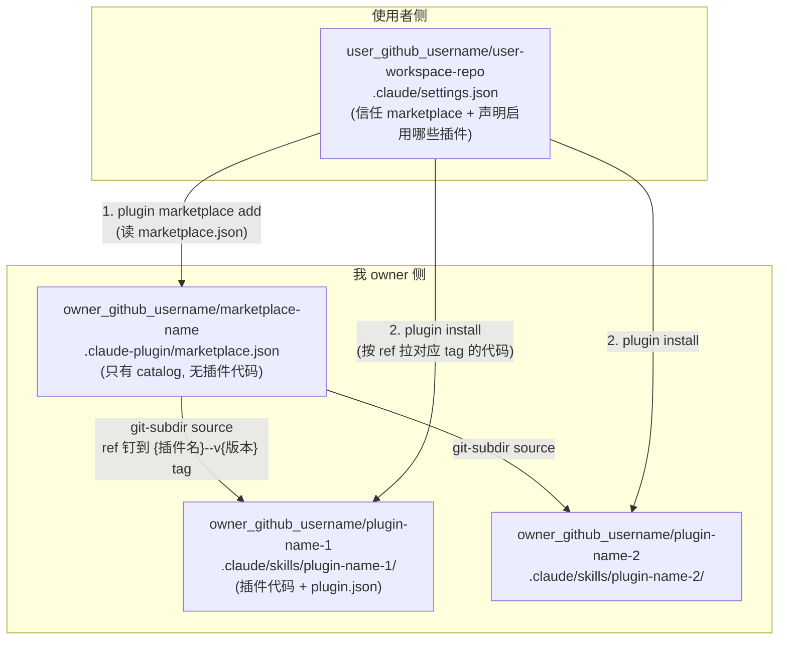
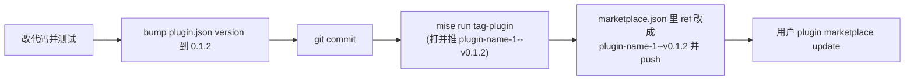

# 个人 Plugin 与 Marketplace 维护最佳实践

这份文档是我维护自己的 Claude Code 插件的最终结论, 覆盖从一个插件的目录结构, 到开发时怎么加载测试, 到打包进 marketplace 发布, 到跨插件依赖, 再到私有仓库认证的完整流程. 所有结论都是在几轮权衡后拍板的, 每一节除了 "怎么做" 也写清了 "为什么这么选", 方便以后回看时不用重新推导.

一句话概括我的架构: 每个插件是一个独立的 GitHub repo, 另有一个只放 catalog 的中央 marketplace repo 把它们聚合起来; 插件在自己 repo 里放在 `.claude/skills/` 下, 这样开发时自动加载, 发布时用 git-subdir 引用; 发布用 `claude plugin tag` 打 `{插件名}--v{版本}` 的 git tag (我用一个 mise 任务扫描 `.claude/skills/` 后批量打); 插件之间用普通 (不带版本约束) 的依赖互相串联.

> 命名约定: 下文所有仓库名都是占位符. `owner_github_username` 是我 (插件作者) 的 GitHub 用户名, `user_github_username` 是插件使用者的 GitHub 用户名 (可能就是我自己在另一台机器上). 插件名必须是全小写加连字符, 所以我让 **repo 名和插件名保持一致**, 都写成 `plugin-name-1` 这种连字符形式.

---

## 1. 整体架构: 分仓加中央 catalog

我把整套东西拆成三类 GitHub 仓库, 各司其职. 核心思路是把 "插件本体" 和 "插件目录 (catalog)" 彻底分开.

1. **每个插件各自一个 GitHub repo**: 例如 `owner_github_username/plugin-name-1`, `owner_github_username/plugin-name-2`. 每个 repo 独立开发, 独立打 tag, 独立提 issue, 独立 clone. 这是我坚持的硬约束, 因为分仓带来的隔离和可维护性对我最重要.
2. **一个中央 marketplace repo**: 例如 `owner_github_username/marketplace-name`, 里面**只有一个 catalog 文件** `.claude-plugin/marketplace.json`, 不含任何插件代码. 它是一张花名册, 列出 "我有哪些插件, 每个去哪个 repo 拿, 拿哪个 tag".
3. **使用者的 workspace repo**: 例如 `user_github_username/user-workspace-repo`. 使用者在它的 `.claude/settings.json` 里信任我的 marketplace 并声明要启用的插件, 别人 (或我自己在别的机器上) clone 这个 repo 就自动带上插件配置.

marketplace 只是一个 catalog 的引用这一点很关键. 官方对 marketplace 的定义就是 "a catalog that lets you distribute plugins to others". 决定一个目录是不是 marketplace 的, 是它有没有 `.claude-plugin/marketplace.json`, 和插件代码放哪无关. 所以插件散在各自 repo, 由 catalog 用 source 字段远程引用, 是完全成立的.

下面这张图说明三类仓库之间的关系.



---

## 2. 三类仓库的结构与关键文件

### 2.1 Plugin repo 的结构与关键文件

插件在自己的 repo 里放在 `.claude/skills/<插件名>/` 下面. 这是整份文档里最需要记住的一条布局规则, 它同时满足了 "开发时自动加载" 和 "发布时干净引用" 两个诉求.

以 `plugin-name-1` 为例, 假设这个 repo 在开发阶段其实有一堆 skill 和 agent, 但我只想发布其中一部分. 结构如下.

```text
github.com/owner_github_username/plugin-name-1/
└── .claude/
    ├── skills/
    │   ├── skill-1/
    │   │   └── SKILL.md            # 仅开发测试, 不发布
    │   └── plugin-name-1/          # 这一整个文件夹就是插件
    │       ├── .claude-plugin/
    │       │   └── plugin.json     # manifest 放这里
    │       ├── skills/
    │       │   ├── skill-2/
    │       │   │   └── SKILL.md    # 发布内容
    │       │   └── skill-3/
    │       │       └── SKILL.md    # 发布内容
    │       └── agents/
    │           ├── agent-2.md      # 发布内容
    │           └── agent-3.md      # 发布内容
    └── agents/
        └── agent-1.md              # 仅开发测试, 不发布
```

这里的核心思路是, "只发布一部分" 不是靠脚本挑出来的, 而是靠**物理摆放**表达的. 凡是放进 `.claude/skills/plugin-name-1/` 里的东西 (skill-2, skill-3, agent-2, agent-3) 就是插件的正式组件, 会被发布. 凡是留在外面当兄弟目录的 (skill-1, agent-1) 就是这个 repo 自己的 standalone 配置, 只在我打开这个 repo 时作为普通 skill 和 agent 加载, 不属于插件, 不会被发布.

`.claude-plugin/plugin.json` 放在插件文件夹的根, 也就是 `.claude/skills/plugin-name-1/.claude-plugin/plugin.json`. 一个最小的 manifest 长这样.

```json
{
  "name": "plugin-name-1",
  "description": "一句话说明这个插件干什么",
  "version": "0.1.1",
  "author": {
    "name": "owner_github_username"
  }
}
```

有一个容易犯的错误要避免: 不要把 `skills/`, `agents/`, `hooks/` 这些目录放进 `.claude-plugin/` 里面. `.claude-plugin/` 里只放 `plugin.json` 一个文件, 其余所有组件目录都在插件根 (也就是和 `.claude-plugin/` 平级).

### 2.2 Marketplace repo 的结构与关键文件

中央 marketplace repo 只有一个文件.

```text
github.com/owner_github_username/marketplace-name/
└── .claude-plugin/
    └── marketplace.json
```

`marketplace.json` 用 source 字段指向每个插件. 因为我的插件不在 marketplace repo 里, 而是各自独立 repo, 且插件在 repo 里位于 `.claude/skills/plugin-name-1/` 这个子目录, 所以 source 类型要用 `git-subdir`. `git-subdir` 比普通 `github` source 多一个 `path` 字段, 用来指定 repo 里的子目录, 它还会稀疏克隆, 只拉那个子目录, 省带宽.

```json
{
  "name": "marketplace-name",
  "owner": { "name": "owner_github_username" },
  "plugins": [
    {
      "name": "plugin-name-1",
      "source": {
        "source": "git-subdir",
        "url": "https://github.com/owner_github_username/plugin-name-1",
        "path": ".claude/skills/plugin-name-1",
        "ref": "plugin-name-1--v0.1.1"
      },
      "description": "一句话说明"
    },
    {
      "name": "plugin-name-2",
      "source": {
        "source": "git-subdir",
        "url": "https://github.com/owner_github_username/plugin-name-2",
        "path": ".claude/skills/plugin-name-2",
        "ref": "plugin-name-2--v0.3.0"
      },
      "description": "一句话说明"
    }
  ]
}
```

`ref` 钉的是插件 repo 上的一个 git tag. 我用官方的 `{插件名}--v{版本}` 命名法 (例如 `plugin-name-1--v0.1.1`), 这个 tag 由 `claude plugin tag` 生成 (见第 8 节). `ref` 可以是任意已存在的 git tag 名, 所以这个字符串完全合法.

> 为什么用 `{插件名}--v{版本}` 而不是裸的 `0.1.1`: 这是 Claude Code 官方的插件发布 tag 命名法, 好处是 tag 自带插件名前缀 (一个 repo 里将来放多个插件也不会撞 tag), 而且它是 "将来若要上版本约束依赖" 的先决条件, 现在就用等于把那条路预留好了 (见第 5 节). 版本号本身仍是 `0.1.1` 无 v 前缀, `v` 只是 `--v` 这个分隔符的一部分.

有一个坑要记住. 相对路径 source (以 `./` 开头的那种) 只在用户从 git 源或本地目录添加 marketplace 时才解析得了; 如果用户是直接给一个 `marketplace.json` 文件的裸 URL, 相对路径会失效. 我用的是 `git-subdir` 加完整 URL, 且让用户用 `/plugin marketplace add owner_github_username/marketplace-name` 这种方式添加, 所以不受这个坑影响.

还有一个坑是我实测踩过的: `git-subdir` 的 `url` 字段**必须写完整的 `https://github.com/owner/repo` URL, 不要用 `owner/repo` 简写**. 简写时 Claude Code 会把它拼成 SSH 远程 (`git@github.com:owner/repo.git`) 去 clone, 如果这台机器从没配过 SSH (没有 `~/.ssh` 目录, 没有已信任的 host key, 没有注册到 GitHub 账号的 key), 装插件会直接报错 `Host key verification failed` / `Permission denied (publickey)`, 而且这个坑跟仓库是不是 public 无关 (SSH 协议本身就要认证, 不像 HTTPS 能匿名拉公开仓库). 写成完整 `https://` URL 就会走 HTTPS 匿名 clone, 公开仓库不需要任何凭证就能装. 我在 2.3 里 `extraKnownMarketplaces` 用的 `github` source (`repo` 字段, 不是 `url`) 目前没观察到这个问题, 但保险起见同样建议只在真的需要私有仓库认证时才依赖 SSH, 参见第 7 节.

### 2.3 User workspace repo 的结构与关键文件

使用者 (可能就是我自己在另一台机器上) 不需要手动跑 `/plugin marketplace add` 和 `/plugin install`, 而是把这两步固化到 workspace repo 的 `.claude/settings.json` 里. 别人 clone 这个 repo, 信任目录后, Claude Code 会提示装上这些 marketplace 和插件.

```text
github.com/user_github_username/user-workspace-repo/
└── .claude/
    └── settings.json
```

`settings.json` 里两个键搭配使用. `extraKnownMarketplaces` 声明信任哪个 marketplace (等价于 `/plugin marketplace add`), `enabledPlugins` 声明启用哪些插件 (等价于 `/plugin install` + enable). `enabledPlugins` 的键是 `插件名@marketplace名`, 值是 `true`.

```json
{
  "extraKnownMarketplaces": {
    "marketplace-name": {
      "source": {
        "source": "github",
        "repo": "owner_github_username/marketplace-name",
        "ref": "0.1.1"
      }
    }
  },
  "enabledPlugins": {
    "plugin-name-1@marketplace-name": true,
    "plugin-name-2@marketplace-name": true
  }
}
```

注意 `extraKnownMarketplaces` 里指向 marketplace repo 用的是普通 `github` source (marketplace.json 就在那个 repo 根的 `.claude-plugin/` 下, 不是子目录), 这和 2.2 里 marketplace 指向各插件用 `git-subdir` 是两码事, 别混. 装上后拉哪个版本的插件代码, 由 marketplace.json 里那条的 `ref` 决定, 使用者这边不用管版本.

`github` source 也支持可选的 `ref` 字段, 钉 marketplace repo 自己的 branch/tag/commit. 不写 `ref` 就一直跟 marketplace repo 默认分支的 HEAD 走, 我每次 push 新 commit (哪怕还没改 `marketplace.json`) 都可能影响已装用户; 写了 `ref` 就钉死在那个点上, 要升级只能手动把 `ref` 改成下一个 tag. 这个 `ref` 用的是 marketplace repo 自己的版本 tag (裸的 `x.y.z`, 没有 `v` 前缀, 比如 `mise run release` 或 `cookiecutter-pywf_open_source` 模板自带的 release 任务打出来的那种), 和 2.2 里插件 repo 上 `{插件名}--v{版本}` 那套 tag 是两回事, 别混. 是否要钉 `ref`, 取决于我要不要给 marketplace repo 本身的更新节奏加保障; 个人用不那么敏感的话不钉也没事.

---

## 3. 开发时如何加载和测试

把插件放在 `.claude/skills/plugin-name-1/` 下, 是为了利用 skills-directory 插件这个机制. 官方规则是: skills 目录下任何含 `.claude-plugin/plugin.json` 的文件夹, 下次会话会被自动加载为一个名叫 `<插件名>@skills-dir` 的插件, 不需要 marketplace, 不需要 install, 就地发现.

所以当我打开 `plugin-name-1` 这个 repo 时, 会自动发生两件事. 一是 `.claude/skills/skill-1/` 作为普通 skill 加载, 调用名是 `/skill-1`. 二是 `.claude/skills/plugin-name-1/` 作为插件 `plugin-name-1@skills-dir` 加载, 里面的 skill-2, skill-3 立即可用, agent-2, agent-3 也一起加载. 这一切都是零参数自动完成的, Claude Desktop 里同样生效, 不需要任何命令行参数.

改动生效的规则要分清. 改 `SKILL.md` 的正文当场生效. 改插件里的 `hooks/`, `.mcp.json`, `agents/` 这些, 需要跑 `/reload-plugins` 或重启才生效.

skills-directory 插件分个人作用域和项目作用域, 加载限制不同, 这一点在开发时值得注意.

| 组件 | `~/.claude/skills/` 个人作用域 | `<repo>/.claude/skills/` 项目作用域 |
| :--- | :--- | :--- |
| skills / agents / hooks | 正常加载 | 过 workspace trust 后正常加载 |
| MCP servers | 正常加载 | 需逐个批准 |
| LSP servers | 正常加载 | 需先信任 workspace |
| background monitors | 正常加载 | 不加载 |

我在自己 repo 里开发时走的是项目作用域 (repo 的 `.claude/skills/`), 所以第一次打开要接受 workspace trust 对话框. 我关心的 skill, agent, hook 两种作用域都会加载, 受限的只有 MCP (要批准), LSP (要信任), monitor (项目作用域不加载). 如果哪天想要一个零限制的测试环境, 可以把插件临时也放一份到 `~/.claude/skills/` 走个人作用域.

---

## 4. 命名空间: 为什么一切都带前缀

插件里的 skill 调用名永远带命名空间前缀, 这是插件的固有身份, 躲不掉, 也不该躲. 官方明说 "Plugin skills use a `plugin-name:skill-name` namespace, so they cannot conflict with other levels".

所以同一个 skill 文件, 放的位置不同, 调用名不同.

| 位置 | 调用名 |
| :--- | :--- |
| standalone `.claude/skills/skill-1/` | `/skill-1` |
| 插件内 `.claude/skills/plugin-name-1/skills/skill-2/` | `/plugin-name-1:skill-2` |

这意味着一条重要的开发纪律: 凡是注定要进插件的 skill, 一开始就写在插件文件夹里, 直接接受带前缀的名字, 而不是先写成 standalone 的 `/skill-2` 用着以后再搬. 因为搬进去之后调用名会从 `/skill-2` 变成 `/plugin-name-1:skill-2`, 所有引用它的地方都得改.

带前缀这件事不是麻烦, 而是正确. 我的真实用户装了插件后调用的就是 `/plugin-name-1:skill-2`, 所以我开发时也用这个名字测, 测的才是发布出去后一模一样的东西 (命名空间, `${CLAUDE_PLUGIN_ROOT}` 解析, 捆绑的 agent 和 hook 都按插件形态生效). 反过来如果我在开发时用 standalone 的 `/skill-2` 测, 测的是 standalone 形态, 和实际发布的插件形态行为有差异, 等于没测到真东西.

agent 同理. 注定进插件的 agent 直接写在插件的 `agents/` 里, 别在 repo 的 `.claude/agents/` 也留一份同名的. 因为项目和用户级 `.claude/agents/` 的同名 agent 会覆盖插件里的 agent, 两边都放会让我误以为插件没加载, 其实是外面那份把它盖住了.

---

## 5. 插件间的依赖管理

我采用普通依赖 (不带版本约束), 这是在权衡后明确放弃 semver 范围锁定的结论. 先说怎么做, 再说为什么这么选.

做法是, 如果 plugin-name-2 需要用到 plugin-name-1 (比如 plugin-name-2 里某个 skill 会调用 plugin-name-1 的 skill), 就在 plugin-name-2 的 `plugin.json` 里用**裸字符串**声明依赖.

```json
{
  "name": "plugin-name-2",
  "version": "0.3.0",
  "dependencies": ["plugin-name-1"]
}
```

裸字符串的意思是 "依赖 plugin-name-1, 版本跟着它在 marketplace 里那条 source 的 `ref` 走", 也就是我在 2.2 里写的 `plugin-name-1--v0.1.1`. 因为 plugin-name-1 和 plugin-name-2 都列在同一个中央 marketplace 里, 属于同一个 marketplace, 所以不需要配任何跨 marketplace 的 allowlist.

声明依赖之后, Claude Code 会替我兜底这几件事, 这些是 "我保证会装两个" 这种口头承诺给不了的.

- 自动安装: 用户装 plugin-name-2, plugin-name-1 会被自动一起装上.
- 连带启用: 启用 plugin-name-2 会连带启用 plugin-name-1.
- 防误删: 用户想 disable plugin-name-1 时, 如果 plugin-name-2 还在用, 会被拦下并提示先关 plugin-name-2.
- 缺失报错: 依赖没装或被禁用时, plugin-name-2 会被禁用并报 `dependency-unsatisfied`, 而不是默默失灵.

为什么不上带版本约束的依赖 (`~1.0.0` 那种 semver 范围)? 有两层原因.

第一层是场景原因: 版本约束是给 "上游是别的团队, 会背着我发破坏性版本" 这种组织场景准备的护栏; 而我一个人既是 plugin-name-1 又是 plugin-name-2 的作者, 要改一起改, 这层护栏几乎永远用不上.

第二层是架构原因: 版本约束的解析规则是 "去该插件所属的 **marketplace 仓库** 上列 `{插件名}--v*` 的 tag, 再挑满足范围的最高版本". 而我这套架构里, tag 打在**各插件自己的 repo** 上, 中央 marketplace repo 只放 catalog, 上面根本没有这些 tag. 所以在 "中央 catalog 加 git-subdir 分仓" 的结构下, 版本约束会因为 marketplace repo 上找不到 tag 而报 `no-matching-tag`. 要既分仓又用版本约束, 得让每个插件 repo 自己也变成一个 marketplace, 再走跨 marketplace 依赖, 机器多很多, 性价比太低.

好消息是, 我从第 8 节起就已经用 `{插件名}--v{版本}` 这套官方 tag 命名法了 (这是版本约束解析所需的 tag 格式). 所以现在虽然不上版本约束, 但先决条件已经就位: 哪天真需要 semver 锁定, 只差 "把插件 repo 也做成 marketplace" 这一步, 是纯增量改造, 不推翻现在的任何东西.

---

## 6. Skill 之间的互相引用

当 plugin-name-1 内部的 skill-2 需要引用同插件的 skill-3 时, 直接在 skill-2 的 `SKILL.md` 正文里用自然语言写出来, 引用它的**真实调用名** (带命名空间).

```markdown
当遇到 xx 情况时, 调用 `plugin-name-1:skill-3` 技能来完成这一步.
```

skill 之间的引用是自然语言驱动的, Claude 读到这句话就会去调那个 skill. 官方没有 "相对引用" 或 "省略前缀" 的语法, 所以老老实实写全名 `plugin-name-1:skill-3` 最稳.

这个引用名跨开发和发布是稳定的, 写一次到处通用, 不用改. 因为前缀等于插件的 `name` 字段, 和加载来源无关. 开发时插件是 `plugin-name-1@skills-dir`, 发布后是 `plugin-name-1@marketplace-name`, 那个 `@` 后面的来源标签只是管理用的身份 (比如 `claude plugin disable` 时用), skill 的调用名始终是 `plugin-name-1:skill-3`. 唯一会让引用失效的情况是我给插件改名, 所以插件名一开始就要想好, 别随便改.

如果是跨插件引用 (plugin-name-2 的 skill 要调 plugin-name-1 的 skill), 除了在正文里写 `plugin-name-1:skill-2`, 还要在 plugin-name-2 的 `plugin.json` 里声明 `dependencies: ["plugin-name-1"]` (见第 5 节), 这样才有自动安装和防误删的保障, 而不是靠用户碰巧装了 plugin-name-1.

---

## 7. 私有仓库的 GitHub 认证

我的 marketplace repo 和 plugin repo 都可以是 private. Claude Code 支持从私有仓库装插件, 但要分清两种场景, 它们的认证方式不同.

第一种是手动安装和更新, 也就是我主动跑 `/plugin install` 和 `/plugin marketplace update`. 这时 Claude Code 用我**已有的 git credential helper**, 和我在终端里 `git clone` 私有仓库能不能成功完全一样. 所以本地 git 凭证配好就行.

我平时用 GitHub CLI, 好消息是 `gh` 本身就能把 git 的凭证配好, 我不用单独学 git 那套. 已经 `gh auth login` 之后, 只要再跑一句.

```bash
gh auth setup-git
```

这行是把 `gh` 注册成 git 对 `github.com` 的 credential helper. 之后 `git clone` 私有仓库会自动用 gh 的 token 认证, Claude Code 手动装插件走的就是这条路. 这就是 "用 git 命令配 GitHub 凭证" 的答案, 交给 `gh auth setup-git`, 不用手写.

如果不想用 gh, 纯 git 的等价做法在 macOS 上是一行, 首次 clone 私有仓库时输一次用户名加 PAT (当密码), 之后钥匙串记住.

```bash
git config --global credential.helper osxkeychain
```

第二种是后台自动更新, 也就是 Claude Code 启动时自动检查插件更新. 这时**不走** credential helper (启动时弹交互框会卡住启动), 所以要在环境变量里放 token. 在 `~/.zshrc` 里加一行, 借用 gh 已登录的 token.

```bash
export GH_TOKEN=$(gh auth token)
```

或者放一个专门的 PAT, 需要 `repo` scope. 不配这个的话, 后台自动更新拉不到私有仓库, 但我手动 `/plugin marketplace update` 仍然能更新, 因为那条走 helper.

GitHub 相关的 token 环境变量是 `GITHUB_TOKEN` 或 `GH_TOKEN`, 两个都认.

---

## 8. 发布与更新的完整流程

发布一个新插件, 或给已有插件发新版本, 走下面这套步骤. 这里以给 plugin-name-1 从 `0.1.1` 升到 `0.1.2` 为例.

**第一步, 改代码并测试.** 在 plugin-name-1 repo 里改, 改完靠 `@skills-dir` 自动加载测一遍 (见第 3 节).

**第二步, bump version.** 把 `.claude/skills/plugin-name-1/.claude-plugin/plugin.json` 里的 `version` 字段从 `0.1.1` 改成 `0.1.2`. 这个 `version` 是 Claude Code 判断 "有没有新版本" 的缓存键, 不 bump 它, 用户即使 update 也拿不到变化. 它同时也是 tag 名 (`plugin-name-1--v0.1.2`) 的来源.

**第三步, 提交.** 必须先 commit, 因为下一步打 tag 要求插件目录下工作区干净.

**第四步, 打并推 tag.** 打的是 `{插件名}--v{版本}` 这种官方发布 tag. 单个插件时, cd 到插件目录直接用官方命令.

```bash
cd .claude/skills/plugin-name-1
claude plugin tag --push
```

`claude plugin tag` 会自己从 `plugin.json` 读出 `name` 和 `version`, 拼成 `plugin-name-1--v0.1.2`, 打 tag 前还会校验插件内容, 检查插件目录工作区干净, 若已存在同名 tag 就拒绝 (需要 `--force` 才移动). 它文档里说会 "校验 plugin.json 和**任何** enclosing marketplace entry 一致" —— 关键词是 "任何", 也就是说 enclosing marketplace 是可选的; 我的插件 repo 里根本没有 marketplace.json, 它就只校验插件内容和干净工作区, 照样能打出 tag. `--push` 会顺带把 tag 推到 origin.

我把这一步包装成了一个 mise 任务, 免得记命令、也免得插件多了漏打.

```bash
mise run tag-plugin
```

它背后是一个 0 依赖纯标准库 CLI: `.claude/skills/maintain-claude-plugins/scripts/plugin_release.py` (跟着 skill 走, 在任何插件 repo 里都能用). 逻辑分三步:

1. **定位 repo 根**: 从当前目录往上找 `.git`, 找到就是 git repo 根.
2. **发现并校验插件**: 扫描 `<repo根>/.claude/skills/` 下每个目录. 含 `.claude-plugin/plugin.json` 的当插件, 校验它有 `name`/`description`/`version` 且 `version` 是 `x.y.z`; **有文件但格式不对就报错并中止** (绝不在校验不过时打 tag). 没有 manifest 的当 standalone skill, 直接忽略.
3. **逐个打 tag**: 对每个通过校验的插件, cd 进它的目录跑 `claude plugin tag --push`, 已存在的 tag 自动跳过 (幂等).

单插件 repo 里它就等价于上面那 `cd` + `claude plugin tag --push` 两行; 多插件 repo 里它一把梭把每个插件按各自的 name+version 打好. 这个脚本也能独立跑, 不依赖 mise:

```bash
# 只发现和校验, 不打 tag (加 --json 输出机器可读)
python3 .claude/skills/maintain-claude-plugins/scripts/plugin_release.py list
# 打 tag (--no-push 只本地打, --force 移动已存在 tag)
python3 .claude/skills/maintain-claude-plugins/scripts/plugin_release.py tag
```

`mise run list-plugins` 是 `list` 子命令的快捷方式, 发版前想先确认插件清单和 tag 名时用它.

**第五步, 更新 marketplace.** 去中央 marketplace repo, 把 plugin-name-1 那条的 `source.ref` 从 `"plugin-name-1--v0.1.1"` 改成 `"plugin-name-1--v0.1.2"`, 提交, 推送. 让 `plugin.json` 的 version, git tag, marketplace 的 ref 三者对齐在同一个号上, 是我给自己定的纪律, 避免版本错位.

**第六步, 用户侧刷新.** 用户跑 `/plugin marketplace update` 刷新花名册, 就会收到新版本.

下面这张图是发新版的顺序.



---

## 9. 用户如何安装和使用

作为用户 (包括我自己在别的机器上用), 有两种装法.

**声明式 (推荐).** 在 workspace repo 的 `.claude/settings.json` 里写好 `extraKnownMarketplaces` 和 `enabledPlugins` (见 2.3), clone 下来信任目录就自动装.

**命令式.** 手动两步.

```bash
/plugin marketplace add owner_github_username/marketplace-name
/plugin install plugin-name-1@marketplace-name
```

第一步告诉 Claude Code 有这么一个花名册, 它去 clone 这个 repo 读 `marketplace.json`. 第二步用 `插件名@marketplace名` 装某一个具体插件, 装的时候按 marketplace.json 里那条 source (带我写的 `ref: "plugin-name-1--v0.1.1"`) 去 plugin-name-1 repo 拉对应 tag 的代码. 如果这个插件声明了依赖, 依赖的插件会被自动一起装上.

装完后, 插件里的 skill 调用名是带命名空间的 `/plugin-name-1:skill-2`. 以后更新靠 `/plugin marketplace update` 刷新花名册, 当我 push 了新的 marketplace.json 或插件 `plugin.json` 的 version 升了, 用户才会收到更新.

---

## 10. 命令与决策速查

日常会用到的命令集中在这里.

| 目的 | 命令 |
| :--- | :--- |
| 开发时手动加载插件 (CLI) | `claude --plugin-dir .` |
| 改动后热重载插件组件 | `/reload-plugins` |
| 配好 git 对 GitHub 的凭证 | `gh auth setup-git` |
| 让后台自动更新能拉私有仓库 | `export GH_TOKEN=$(gh auth token)` |
| 添加 marketplace | `/plugin marketplace add owner_github_username/marketplace-name` |
| 安装插件 | `/plugin install plugin-name-1@marketplace-name` |
| 刷新 marketplace | `/plugin marketplace update` |
| 打单个插件的发布 tag | `cd .claude/skills/plugin-name-1 && claude plugin tag --push` |
| 发现并校验所有插件 (不打 tag) | `mise run list-plugins` |
| 扫描并批量打所有插件的发布 tag | `mise run tag-plugin` |

关键决策我做过的选择集中在这里, 方便以后回看时知道每条是权衡过的, 不是随手定的.

| 决策点 | 我的选择 | 主要理由 |
| :--- | :--- | :--- |
| 仓库划分 | 每个插件独立 repo, 另有一个中央 catalog marketplace repo | 分仓的隔离和可维护性对我最重要 |
| 插件在 repo 里的位置 | `.claude/skills/<插件名>/` | 开发时 `@skills-dir` 自动加载, Desktop 也生效 |
| marketplace 引用插件的 source 类型 | `git-subdir` | 插件在别的 repo 的子目录里, 只有 git-subdir 能指子目录 |
| 发布 tag 命名 | `{插件名}--v{版本}`, 用 `claude plugin tag` 打 | 官方发布 tag 格式, 自带插件名前缀不撞车, 且预留了将来上版本约束的路 |
| 打 tag 的操作 | `mise run tag-plugin` 扫描 `.claude/skills/` 批量打 | 免记命令、插件多了不漏打、幂等 |
| 依赖管理档位 | 普通依赖 (裸字符串), 不带 semver 范围 | 拿到自动装和防误删, 版本约束在个人维护下用不上, 且约束解析要求 tag 在 marketplace repo 上, 与分仓冲突 |
| skill 调用名 | 接受 `plugin-name:skill-name` 前缀 | 前缀是插件固有身份, 且测的是真实发布形态 |
| 用户侧安装 | workspace repo 的 `.claude/settings.json` 声明式装 | clone 即用, 配置进版本控制 |
| 私有仓库认证 | 手动走 `gh auth setup-git`, 自动更新配 `GH_TOKEN` | gh 能替我配好 git 凭证, 不用手写 |
| `git-subdir` 的 `url` 字段写法 | 完整 `https://github.com/owner/repo`, 不用 `owner/repo` 简写 | 简写会被拼成 SSH 远程去 clone, 没配 SSH 的机器会卡在 host key / publickey 认证; 完整 https URL 走匿名 HTTPS, 公开仓库不需要凭证 (实测踩过的坑) |
